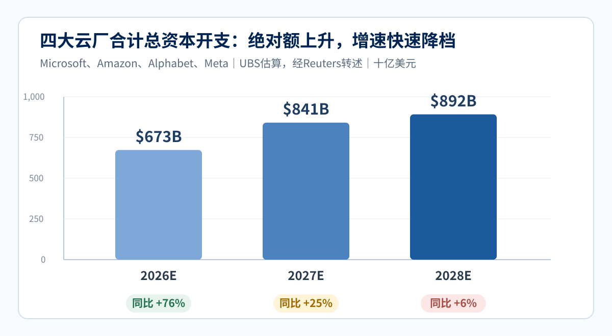
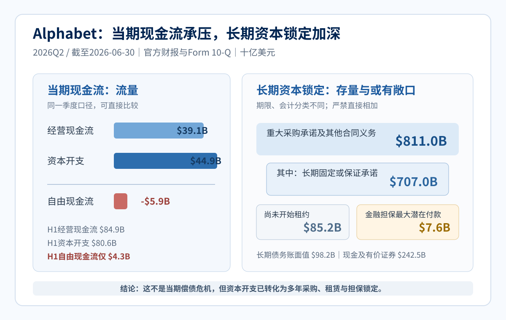
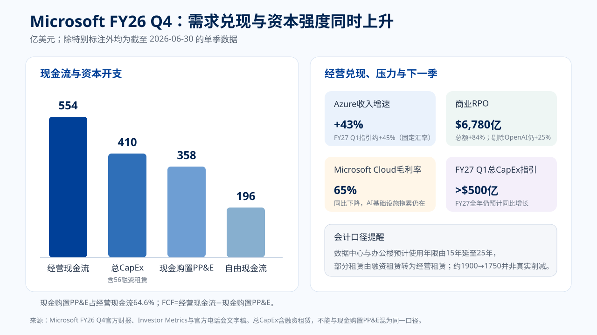
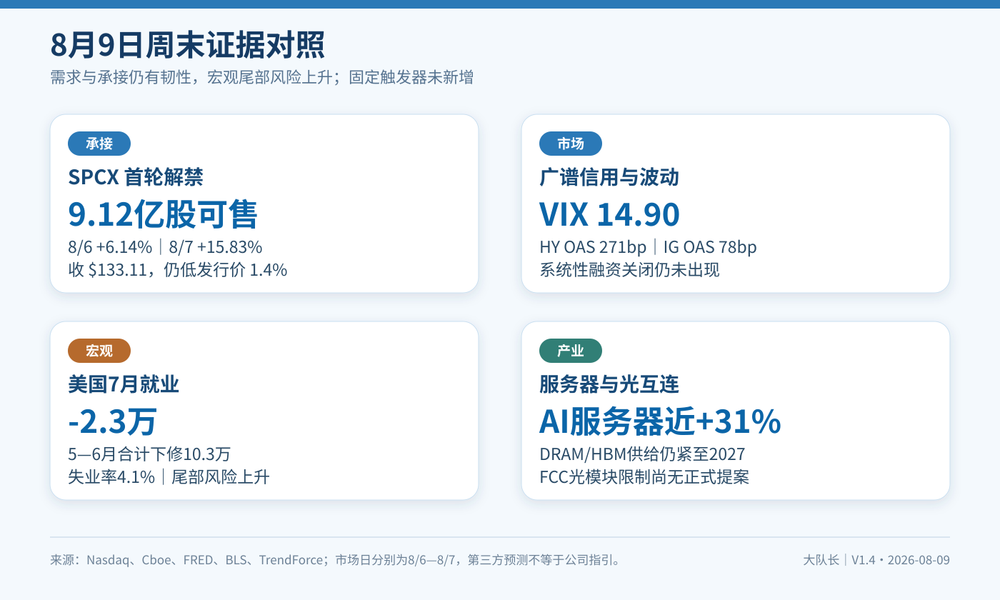
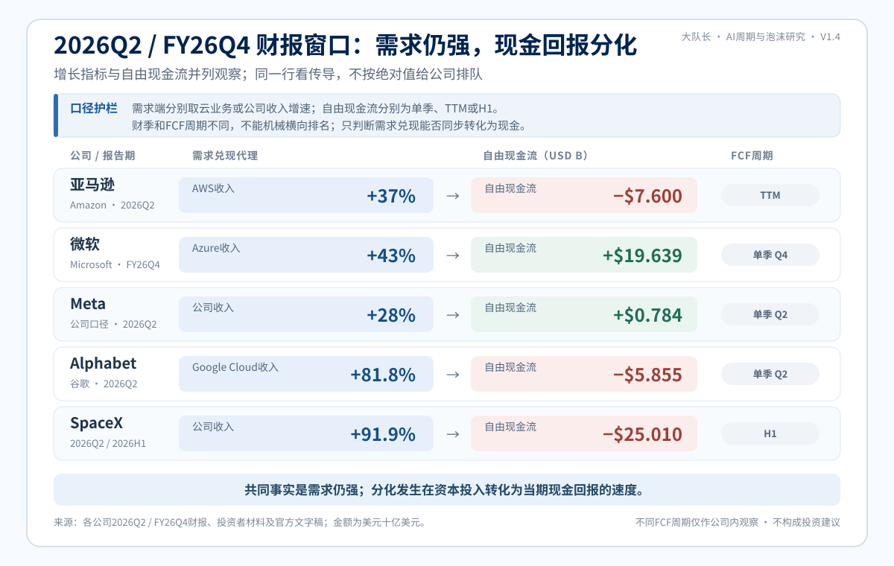
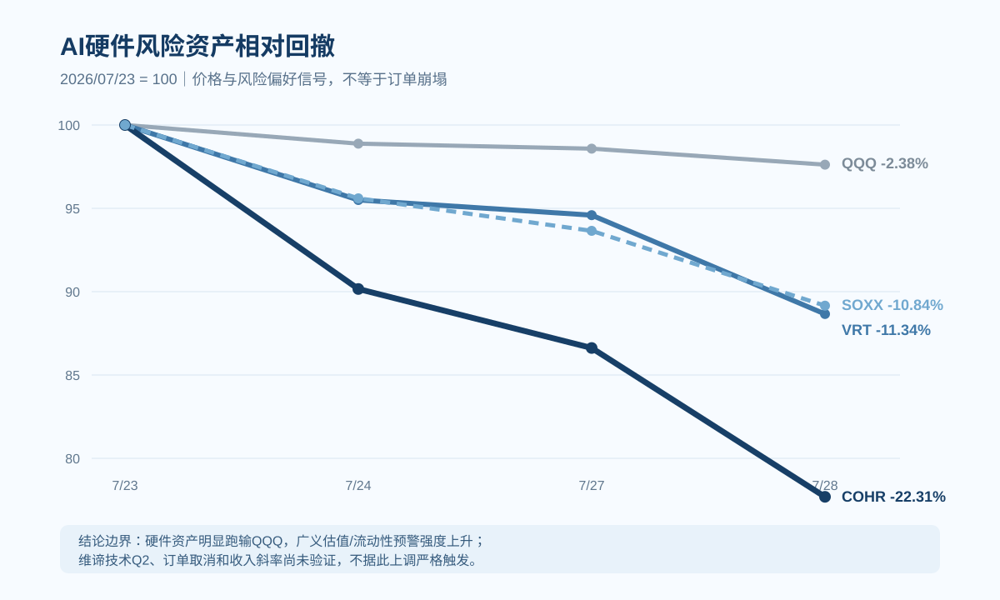

## 重要免责声明

本报告是个人基于公开信息完成的研究维护版，用于研究方法展示、事实核验与情景推演，不代表所在机构意见，不构成任何证券的投资建议、收益承诺或交易指令。报告中的分数、概率和触发器是可复盘的研究工具，不是统计意义上的精确崩盘概率，也不直接对应仓位、减仓或对冲比例。市场价格、公司指引与传媒报道会持续变化，读者应核对原始来源并独立判断。

---

## V1.4 更新模块｜滚动核验至2026-08-09

> **数据截止**：公司公告、监管文件与一手研究资料滚动核验至 2026-08-09（北京时间，周末复核）；E判断的A股事前窗口结算截至 2026-07-24，SPCX与VIX更新至 2026-08-07，信用利差更新至 2026-08-06，CAPE及其他市场价格保留各自标注日期。

<!-- status-split -->

> **版本性质**：这是当前研究维护版。历史发布包中的研究材料及已登记的前瞻判断原件全部冻结，不回写、不追溯改写。

<!-- status-split -->

> **一句话结论**：需求侧仍然满载，融资与估值侧裂缝扩大；“满载 × 裂缝”的晚周期结构更清晰，但严格崩盘触发仍只有 1/3，尚未达到把风险观察切换为系统性减仓或对冲的全面执行信号。

<!-- status-split -->

> **2026-07-21 滚动核验**：SPCX 7/20 收 $119.85，较 $135 发行价低 11.2%、较 6/16 峰值回撤 46.9%；事实审计表新增新易盛、天孚通信 2026 H1 业绩预告（67→69 项）。新易盛业绩子样本越过 E 判断 2 事前 ≥60% 成立线，但整条仍待定；不改 77 分、情景概率和 1/3、2/3。

<!-- status-split -->

> **2026-07-23 Alphabet 滚动核验**：Google Cloud收入同比+81.8%、营业利润率35.6%，验证需求与变现；单季CapEx $44.924B超过经营现金流$39.069B、FCF -$5.855B，验证现金流裂缝。E判断4成立，事实审计表69→71项；不改77分、A44/B22/C10/D24、严格1/3和广义2/3。

<!-- status-split -->

> **2026-07-24 复审核验**：补入 Alphabet 官方 CEO 书面发言——Cloud 积压订单 $514B、模型 API 每分钟处理 220 亿 tokens、既有客户使用量超承诺额逾 50%，且供给仍受限；补入 7/23 市场反应，并按 DeepSeek 官方资料、华为云公告及 7/22 论文修正“V4-Pro 完全运行于华为芯片/DeepSeek R2 32B”旧口径。事实审计表71→73项；指数、概率与触发数不变。

<!-- status-split -->

> **2026-07-24 A股收盘核验**：新易盛预告后五个交易日窗口已经结束。7/24收476.02元，五日最高收盘551.77元，比事前原件采用的6/23收盘锚552.00元低0.23元（0.04%）。按事前未设置容差的规则，价格腿属于**规则内临界成立**；若另设0.1%安全边际，则应记为临界未决。为避免事后移动门槛，本版保留“成立”结算并显式披露敏感性。中际旭创业绩腿仍待披露，因此E判断2整条继续记“部分验证”，总记分仍为3条成立、1条部分验证、2条待核、0条错误。

<!-- status-split -->

> **2026-07-29 SEC文件复核**：Alphabet 2026Q2 Form 10-Q 已于7/23提交，撤销此前“10-Q尚未找到”的错误状态。文件披露：长期固定或保证承诺$707.0B、重大采购承诺及其他合同义务$811.0B、尚未开始的租约未来付款$85.2B、金融担保最大潜在付款$7.6B。上述口径存在范围差异与潜在重叠，严禁相加；它们强化资本锁定和执行风险，也同时说明公司在主动锁定供给，故不单独上调77分。

<!-- status-split -->

> **2026-07-29 NVIDIA融资观察**：NVIDIA FY2026 10-K已披露现有设施租约担保最大敞口$3.5B；7/26起多家媒体转述其正讨论为OpenAI俄亥俄10GW项目提供约$250B融资担保，并另议最高$350B芯片采购融资。后两项尚无NVIDIA/OpenAI官方确认，按“报道中的洽谈”列为WATCH，不计入严格触发或指数。

<!-- status-split -->

> **2026-07-29 Meta结构融资核验**：Meta 7/28正式披露El Paso 1GW数据中心合资安排：总开发成本约$14B，BlackRock/Meta按80%/20%出资，BlackRock一侧拟使用$12.5B项目债，Meta长期租用整个园区并承担初始阈值约$13B的递减剩余价值担保。这验证“股权＋项目债＋租赁＋担保”的表外迁移，但$12.5B不是Meta表内债务，交易仍待交割，不新增严格触发。

<!-- status-split -->

> **2026-07-30 Microsoft财报核验**：Microsoft FY26Q4收入$90.007B（同比+18%），Azure及其他云服务收入增长43%，Commercial RPO达$678B（+84%；剔除OpenAI后+25%），管理层仍称需求超过可用产能。Q4总CapEx约$41B，其中约三分之二为短寿命CPU/GPU；现金购置PP&E $35.802B，经营现金流$55.441B，自由现金流$19.639B、同比下降约23.2%。这是“需求兑现＋资本回收压力”双验证，不改变77分、A44/B22/C10/D24、严格1/3和广义2/3。

<!-- status-split -->

> **2026-07-30 Meta财报与E判断5结算**：Meta Q2收入$60.801B（+28%），经营利润率31%（上年43%）；CapEx（含融资租赁本金）$31.080B，经营现金流$31.862B，自由现金流仅$0.784B。全年CapEx区间由$125B–$145B收窄至$130B–$145B。按冻结阈值，已发布官方文字没有量化Meta Compute利润率、没有给出具名承购合同，也没有下调CapEx，故E判断5记为“按事前阈值成立”；这不等于Meta AI业务失败。

<!-- status-split -->

> **2026-07-30 FOMC与E判断6结算**：FOMC维持联邦基金目标区间3.50%–3.75%，以9票赞成、3票反对通过；三名反对者主张加息25个基点。声明没有释放明确重启降息信号，按冻结阈值E判断6成立。E记分卡由3条成立、1条部分验证、2条待核，更新为5条成立、1条部分验证、0条待核、0条错误；E结算不机械映射为综合指数或情景概率调整。

<!-- status-split -->

> **2026-07-30 维谛技术Q2核验**：维谛技术Q2收入$3.274B（+24.1%，有机+18%），调整后营业利润率22.6%（同比+410bp），经营现金流$1.100B，调整后自由现金流$0.925B；公司上调全年收入、利润率、EPS和自由现金流指引。有机增速低于原20%–24%指引下限，管理层归因于临时供应链拥堵与项目分阶段执行；官方Q2材料未披露新的定量订单、backlog或book-to-bill，旧期数字不得冒充本季值。结果继续说明核心需求斜率尚未断裂，不改触发器与77分。

<!-- status-split -->

> **2026-08-05 Amazon核验**：Amazon Q2收入$200.6B（+20%），AWS收入$42.2B（+37%）、营业利润$16.6B；AWS AI与芯片业务年化收入均超过$25B。与此同时，过去十二个月经营现金流$161.4B，但现金资本开支升至$169.0B，自由现金流由+$18.2B转为-$7.6B。需求与经营兑现继续证真，现金回报裂缝也同步扩大。

<!-- status-split -->

> **2026-08-05 Amazon融资与利润质量核验**：Amazon Q2净利润$62.6B中包含约$53.4B非经营性收益，主要来自Anthropic投资，其中私募股权价格上调贡献约$50.5B。公司同时扩展OpenAI与Anthropic云服务承诺、股权投资和与算力交付里程碑挂钩的融资安排；这些是商业合同、股权与融资承诺的组合，不能机械相加成“AI债务”，但验证了循环融资与利润质量拆分的重要性。

<!-- status-split -->

> **2026-08-05 Microsoft与Meta文件补证**：Microsoft FY2026 10-K披露尚未起租、主要为数据中心的租赁承诺$329.1B；Meta 10-Q披露未起租租赁$279.0B、不可取消合同承诺$349.3B及至多$14.7B条件性云容量义务。两家公司完整官方Q&A均已取得；Meta仍未量化Meta Compute利润率或披露具名承购合同。不同口径不得相加，新增证据强化资本锁定与财务结构观察，但不新增硬触发。

<!-- status-split -->

> **2026-08-05 Apple核验**：Apple FY26Q3收入$109.4B（+16%），研发费用$11.7B（+32.3%），公司说明增长部分来自包括AI在内的基础设施成本；九个月经营现金流$117.0B、现金购置PP&E仅$6.8B。Apple同时使用自有数据中心和第三方云，说明AI投入可落在研发、服务采购与资本开支多个口径中，不能仅凭现金PP&E下降判断AI投入收缩。

<!-- status-split -->

> **2026-08-05 SpaceX Q2核验**：SPCX Q2收入$7.814B（+92%），经营亏损收窄至$0.143B，期末RPO $47.461B；但上半年经营现金流$3.466B、现金购置PP&E $28.476B，研究口径自由现金流代理为-$25.010B。AI业务收入高速增长、CapEx也高度集中于AI；8/6最多约9.115亿股进入首个财报后解禁窗口。需求斜率尚未断裂，私募平/降轮也未出现，故严格1/3、广义2/3及77分不变。

<!-- status-split -->

> **2026-08-09 周末核验**：SpaceX首轮最多约9.12亿股取得出售资格后，SPCX 8/6上涨6.14%至$114.92，8/7再涨15.83%至$133.11，仍低于$135发行价1.4%；VIX降至14.90，HY/IG OAS为271/78bp，广谱信用与波动率未恶化。与此同时，美国7月非农就业减少2.3万，5—6月合计下修10.3万，宏观尾部风险抬升。TrendForce将2026年AI服务器出货增速预测上调至接近31%，并提示HBM/DRAM供给仍紧；光模块限制仍是媒体所述政策方案、未见FCC、BIS或Federal Register正式规则文本。Alphabet另发行10档合计$25.0B高级无抵押债，但用途只写一般公司用途；SpaceX与Tesla公布Terafab首期约$16.8B投资计划，与此前地方申报的$55B口径分栏。新增13ah—13an七项，事实审计表88→95项；证据方向相反且没有新增严格触发，77分、A44/B22/C10/D24、严格1/3和广义2/3不变。

### 0. V1.4滚动更新日志（7/20—8/9）

#### V1.4·8/9周末｜解禁结算、宏观与供应链复核

**改动一：SpaceX解禁从“待观察”改为“首轮已结算”。** 8/6约9.12亿股取得出售资格，但当日SPCX上涨6.14%至$114.92；8/7再涨15.83%至$133.11，仍低于$135发行价1.4%。这说明首轮供给没有形成即时价格踩踏，但两日反弹不能证明后续解禁已无风险，也不构成私募新一轮定价。

**改动二：广谱市场地基更新。** VIX更新至14.90（8/7），HY/IG OAS更新至271/78bp（8/6）；相较上一截止点，波动与高收益利差继续回落，局部资本锁定尚未扩散成系统性信用关闭。

**改动三：美国就业转弱。** 7月非农就业减少2.3万，失业率4.1%，5—6月合计下修10.3万，过去12个月月均新增仅3.4万。宏观尾部风险上升，但利差和波动率没有同步恶化，因此暂列WATCH，不上调C情景或新增触发。

**改动四：AI服务器需求旁证。** TrendForce把2026年全球AI服务器出货增速预测从28%上调至接近31%，估算九大CSP资本开支同比约增90%。这是第三方研究估算，不是公司指引；它反对“当期需求已经崩塌”，但不能替代收入、利用率和现金回报验证。

**改动五：内存约束与架构调整。** TrendForce称DRAM供给将紧至2027年，NVIDIA及部分CSP正在评估降低下一代产品HBM配置；最终规格尚未确定，且没有NVIDIA一手确认。本版将其列为“供给约束推动架构优化”，不误写成需求削减。

**改动六：光模块政策口径。** TrendForce称中国企业约占2026年全球光模块代工产能56%，并明确FCC提案尚未正式发布、关键定义不清。本版只列政策WATCH，不写成“禁令落地”，也不改变E判断2。

**改动七：待发布日历纠正。** TSMC 7月营收仍待8/10 13:30（北京时间）发布；Lumentum财报窗口改为北京时间8/12清晨，Coherent高意为8/13 04:30；未披露数据一律不提前入表。

**改动八：Alphabet融资补证。** Alphabet 8/6定价、8/7提交最终文件，发行10档合计$25.0B高级无抵押债，预计净募约$24.8B并于8/10交割；用途仅为一般公司用途（可包括偿债），不能写成AI专项融资。同日ATM文件只是增加销售代理，没有扩大$40B上限，也不证明已经发行新股。

**改动九：Terafab首期计划。** SpaceX与Tesla公布在Texas建设Terafab，官方项目页确认逻辑、内存和先进封装一体化及1TW/年目标；Reuters披露首期约$16.8B。该数字与5月地方申报的$55B初始投资、远期扩建口径不是同一范围，不能相互替换，更不能把计划额当已发生CapEx。

**改动十：审计与图表。** 新增13ah—13an七项事实，事实审计项目由88项增至95项；新增“8/9周末证据对照”图，将估值承接、广谱信用、宏观就业与供应链证据分栏。

**判断影响。** 解禁承接、服务器需求与偏窄利差支持需求/流动性未失序，就业转弱和长期资本消耗提高尾部风险。证据相互制衡，且没有满足新的固定硬条件，因此指数77、A44/B22/C10/D24、严格1/3和广义2/3均不变。

#### V1.4·8/5晨间｜五大公司财报、资本锁定与SPCX解禁

**改动一：Amazon需求与经营。** 新增Q2收入、AWS收入与营业利润、AI/芯片业务年化收入；需求仍受供给约束，反对“当前需求已经崩塌”。

**改动二：Amazon现金回报。** 分开经营现金流、现金资本开支和自由现金流；过去十二个月自由现金流转负，验证扩建速度已经超过当期现金创造。

**改动三：Amazon循环融资与利润质量。** 新增OpenAI、Anthropic云服务承诺、股权投资和算力交付挂钩融资安排；将Anthropic估值上调带来的非经营收益从经营利润中剥离。

**改动四：Microsoft资本锁定。** 补入FY2026 10-K的未起租租赁、采购、建设和PP&E应付口径；强调不同合同义务不能相加成“AI总债务”，短寿命设备与建设节奏仍具一定调整空间。

**改动五：Meta官方Q&A与10-Q。** 删除“完整官方Q&A待补”旧状态；补入算力溢价承接、长期能见度边界、第三方云和合资资本结构，以及未起租租赁和合同承诺。

**改动六：Apple应用端对照。** 新增收入、研发、经营现金流和现金PP&E；把研发、第三方云与自有数据中心拆开，避免用低现金CapEx误判AI投入。

**改动七：SpaceX财报与解禁。** 新增Q2经营、分部、RPO、客户集中度、CapEx、现金与债务；将管理层前瞻与已实现数据分栏，并新增8/6解禁供给观察。

**改动八：信用与波动率。** HY OAS更新至278bp、IG OAS至78bp、VIX至15.86（均截至8/3）；广义信用没有恶化，局部融资与单名风险仍未扩散为系统性收缩。

**改动九：审计与图表。** 新增13z—13ag八项事实，事实审计项目由80项增至88项；新增“财报窗口需求与现金流”图，所有动态市场数字保留日期标签。

**判断影响。** 五家公司共同强化“真实需求仍强、资本锁定和现金回报分化扩大”。证据双向且没有触发V1.4固定硬条件，故指数77、A44/B22/C10/D24、严格1/3和广义2/3均不变。

#### V1.4·7/30晨间｜Microsoft与Meta财报、FOMC结算

**改动一：Microsoft需求与经营兑现。** 新增FY26Q4收入、Microsoft Cloud、Azure、Commercial RPO及FY27Q1 Azure指引；剔除OpenAI后的RPO增速与新增来源单列，避免把84%总增速冒充基础客户增速。

**改动二：Microsoft资本开支与现金流。** 分开约$41B总CapEx、$35.802B现金PP&E、$5.6B融资租赁和$19.639B自由现金流；不重复相加，不把RPO当收入或现金。

**改动三：Microsoft会计口径。** 数据中心及办公楼预计使用寿命从15年延至25年，更多未来租赁由融资租赁转为经营租赁；自然年2026披露CapEx由约$190B改为约$175B，属于分类口径变化，底层投资预期不变，不能写成“削减AI投资$15B”。

**改动四：Meta财报。** 新增Q2收入、利润率、CapEx、经营现金流、自由现金流及全年CapEx指引；结论是高投入继续、现金缓冲变薄，不是需求或业务失败已被证明。

**改动五：FOMC。** 记录按兵不动、9—3票型和三名加息异议；它强化利率托底没有反转，但不是新增严格信用或需求触发器。

**改动六：E验证记分卡。** 按冻结阈值结算判断5和判断6为成立，汇总更新为5条成立、1条部分验证、0条待核、0条错误；判断原件不回写。

**改动七：维谛技术。** 将Q2从待发布改为已核；收入有机增速略低于原指引下限，但利润率、现金流和全年指引均走强。没有本季定量订单/backlog披露时，不补造订单数字。

**改动八：审计与图表。** 新增Microsoft经营、Microsoft资本与会计、Meta Q2、FOMC和维谛技术Q2五项事实，并新增“Microsoft需求兑现与现金流”图；事实审计项目由75项增至80项。

**判断影响。** Microsoft与Meta同时证明真实需求仍强、资本与现金流压力也继续扩大；FOMC没有转鸽。新增证据方向相反且没有触发V1.4固定硬条件，因此指数77、A44/B22/C10/D24、严格1/3和广义2/3均不变。

#### V1.4·7/29晨间｜SEC补证、融资观察与图表升级

**改动一：Alphabet 10-Q状态勘误。** 7/23提交的官方10-Q已核到，撤销“尚未找到”；新增长期采购承诺、未开始租约、金融担保和债务结构的审计口径。

**改动二：Meta结构融资。** 新增El Paso合资交易，分开总成本、外部项目债、租约与剩余价值担保；明确项目债不是Meta表内债务。

**改动三：NVIDIA融资观察。** 将官方已披露的$3.5B设施租约担保，与媒体报道中讨论的$250B融资担保、最高$350B芯片采购融资严格分栏；后两者未获公司确认，不当作已签交易。

**改动四：市场地基。** CAPE更新至40.57（7/28）、VIX更新至18.21（7/28）、HY OAS更新至281bp（7/27）；7/23—7/28硬件风险资产明显弱于QQQ，但尚未进入系统性恐慌或信用收缩。

**改动五：证据降级。** TSMC官方只确认先进封装产能极紧并限制客户增长；具体停接单日期和269万片仅保留为市场渠道口径。

**改动六：排版与图表。** 新增“四大云厂CapEx斜率”“Alphabet资本锁定与现金流”“AI硬件风险资产相对回撤”三张图，并将变更点保持一条一段。

**改动七：审计表。** 新增13s Alphabet 10-Q和13t Meta El Paso，事实审计项目由73项增至75项；NVIDIA未确认报道只入WATCH，不伪装成永久事实项。

**判断影响。** 官方10-Q显著提高“资本锁定”证据等级，但其承诺也服务于供给扩张；NVIDIA巨额担保仍处洽谈报道阶段。指数77、A44/B22/C10/D24、严格1/3和广义2/3均不变。

#### V1.4·7/24收盘｜E判断2价格腿结算

**改动一：收盘结算。** 新易盛7/24收476.02元；预告后五个交易日最高收盘551.77元，比6/23收盘锚552.00元低0.23元（0.04%）。按事前零容差规则，价格腿临界成立。

**改动二：验证记分卡。** 新易盛盈利腿成立、价格腿规则内临界成立；中际旭创尚无可核半年报预告，E判断2整条继续记“部分验证”。

**改动三：归因边界。** 7/24上证指数下跌1.61%、深证成指下跌2.47%，个股弱反应含有市场共同因素；本次只按事前规则结算结果，不把全部跌幅归因于公司基本面。

**改动四：阈值敏感性。** 551.77元仅比552.00元低0.04%。若事前规则设有0.1%安全边际，价格腿应记为临界未决；原件没有容差条款，因此不在结果出现后改门槛。

**判断影响。** E记分结构、77分、A44/B22/C10/D24及触发器计数均不变。

#### V1.4·7/24滚动｜官方文字补充与全量复审

**改动一：Alphabet官方文字。** 新增CEO书面发言，补充Cloud积压订单、模型API tokens、Gemini App月活、既有客户超承诺使用和供给约束。

**改动二：市场反应。** 补入7/23 GOOGL、ORCL、NVDA与SPCX市场快照，并明确油价、利率和地缘因素的多变量归因边界。

**改动三：DeepSeek勘误。** 按DeepSeek、华为云与arXiv资料，把“完整预训练替代”修正为“华为云首发适配、V4-Flash API服务＋全参数后训练能力”，撤销无一手来源的R2 32B旧口径。

**改动四：审计表。** 新增13q—13r，事实审计项目由71项增至73项。

**判断影响。** 需求强度继续被确认，市场对高CapEx的容忍度下降；指数77、A44/B22/C10/D24及触发器计数不变。

#### V1.4·7/23滚动｜Alphabet财报后核验

**改动一：经营兑现。** 新增Google Cloud收入、利润和利润率。

**改动二：现金流。** 拆分CapEx、经营现金流、自由现金流和折旧。

**改动三：融资与利润质量。** 补入债务、股权融资和股权证券重估对EPS的影响。

**改动四：验证记分卡。** E判断4由待核转为成立；事实审计表新增13o—13p，由69项增至71项。

**判断影响。** “需求满载×现金流裂缝”得到双验证；指数、概率和触发数不变。

#### V1.4·7/21滚动｜事实审计与E记分卡

**改动一：新易盛。** 新增2026H1净利润同比增长77.56%—102.93%的业绩预告。

**改动二：天孚通信。** 新增2026H1净利润同比增长25%—45%的业绩预告。

**改动三：日期勘误。** 撤销“7/15创业板中报预告统一截止”的错误日历口径。

**改动四：审计表。** 新增13m—13n，由67项增至69项。

**判断影响。** 新易盛业绩子样本成立，E判断2整条仍待定；指数、概率和触发数不变。

#### V1.4·7/20首发｜研究维护版

**改动一：信用。** Oracle降至BBB-，严格信用触发①确认。

**改动二：供需。** 更新TSMC Q2实际值、Q3指引和全年CapEx/收入指引。

**改动三：估值承接。** SPCX于7/17跌破135美元发行价。

**改动四：资本开支。** 新增Reuters转述的UBS四大hyperscaler合计总CapEx 2026—2028增速斜率。

**改动五：市场快照。** 刷新CAPE、VIX、HY OAS、ORCL、NVDA和SPCX。

**改动六：触发器治理。** 将严格执行触发1/3与广义早期预警2/3正式分栏。

**改动七：审计表。** 新增13i—13l，由63项增至67项。

**判断影响。** 指数75→77；概率A42/B22/C11/D25→A44/B22/C10/D24；主时间窗不变。

#### 历史勘误版

**V1.3.4a（2026-07-09）。** 增补CDS口径、Oracle RPO、API通缩、Meta加拿大数据中心、NVIDIA增持CoreWeave和SK海力士上市；当时判断与概率不变。

**V1.3.4（2026-07-07）。** 修正Oracle诉讼日期、SpaceX IPO发行价和美联储点阵图三处事实口径；当时指数75、A42/B22/C11/D25不变。

> **治理说明**：本节只记录V1.4发布后的逐日滚动更新；V0.1—V1.3.4的完整历史沿革保留在后文历史表格中。V1.3.4及以前版本保留原始时点，但可证伪的错误事实已在本版显式列出并更正，避免静默改写。历史发布材料继续冻结。

### 1. V1.4 当前结论

| 项目 | V1.3.4 历史口径 | V1.4 当前口径 | 变化 |
|---|---:|---:|---|
| 综合崩盘指数 | 75 / 100 | **77 / 100** | +2；主要来自 Oracle 信用恶化被正式确认 |
| A 渐进幻灭 | 42% | **44%** | +2pct |
| B 技术颠覆（双向尾部） | 22% | **22%** | 不变 |
| C 宏观共振 | 11% | **10%** | -1pct |
| D 软着陆 | 25% | **24%** | -1pct |
| A+B+C（软着陆以外） | 75% | **76%** | +1pct |
| 严格核心触发 | 历史文本使用了不同事件集，不与本版续算 | **1 / 3** | T-V14-01 Oracle评级/信用事件已确认 |
| 广义早期预警 | V1.4于2026-07-20重新基准化 | **2 / 3** | W-V14-01信用恶化 + W-V14-02估值承接转弱 |

**判断没有反转。** V1.4把A情景再上调2pct，但不把TSMC的强需求机械解释为“更快崩盘”。

**物理侧。** 强需求说明产能与基础设施仍然满载。

**金融侧。** Oracle降级与SPCX跌破发行价，说明金融承接先出现裂缝。

**合并判断。** “物理满载 × 金融裂缝”同时出现，才是当前最重要的晚周期签名。

### 2. 触发器治理：V1.4重新基准化，不与历史x/3续算

| Trigger ID | 层级 | 固定定义 | 首次生效 | 当前状态 | 使用方式 |
|---|---|---|---|---|---|
| **T-V14-01** | 严格 | 关键AI债务主体发生评级下调或同等信用事件 | 2026-07-20 | **CONFIRMED**：S&P官方监管发布入口与专题页确认行动日为7/8、评级为BBB-/A-3、展望稳定；超出官方标题与摘要的细化理由继续分级使用 | 计入1/3；同一Oracle事件的CDS后续扩大不重复计分 |
| **T-V14-02** | 严格 | 私募AI龙头新一轮融资估值持平或下修 | 2026-07-20 | **WATCH↑**：SPCX是二级市场参考，不是私募新一轮定价 | 不计入已触发 |
| **T-V14-03** | 严格 | NVIDIA数据中心收入同比增速低于25% | 2026-07-20 | **SAFE / 待下次财报** | 不计入已触发 |
| **W-V14-01** | 广义 | 债务或单名信用显著恶化 | 2026-07-20 | **已出现**：Oracle评级与CDS | 提高监测频率，不是交易指令 |
| **W-V14-02** | 广义 | 一级或二级估值承接转弱 | 2026-07-20 | **已出现**：SPCX跌破发行价；7/23—7/28硬件资产显著弱于QQQ | 提高监测频率，不是交易指令 |
| **W-V14-03** | 广义 | 核心算力需求斜率断裂 | 2026-07-20 | **尚未出现** | 需要订单、收入或利用率证据，不用几日股价替代 |

**不可比说明。** V1.2的“1.5/3→2/3”使用了NVDA、SpaceX发债等不同事件集，既不是上表严格触发，也不能自动映射为V1.4广义预警。旧序列在V1.2停止；V1.4从2026-07-20重新基准化，后续只按Trigger ID续算。

### 3. 本轮新增三十二项审计事实

#### 3.1 Oracle：信用触发正式确认

**评级变化。** 2026-07-08 05:21 EDT，S&P将Oracle长期发行人评级由BBB/A-2下调至 **BBB-/A-3**，展望稳定，标题明确指向业务风险上升与现金流转弱；Oracle距投机级仅一档。V1.3.4a的2026-07-09是版本日期，不是评级行动日。

**融资背景。** Oracle 2026财年已筹集约 **$43B债务 + $5B股权**，同时AI基础设施资本开支继续扩张。

**信源边界。** S&P官方监管发布索引和“Oracle Downgrade Explained”专题页共同确认降级事件、行动时间、BBB-/A-3与稳定展望；Oracle融资数字来自公司公告。后续若取得单篇rating action固定链接，只补链接，不改已核事实。

**市场快照。** ORCL 7/28收 **$120.12**；Oracle 5年CDS 7/17收约198.23bp、7/20盘中约203bp，而广义HY OAS至7/27仅281bp。这说明单名信用压力显著，尚不是全市场信用关闭。

**判断影响。** “信用恶化”由高位预警升级为严格触发确认。

#### 3.2 TSMC：需求与物理满载继续证真

**Q2实际值。** 收入 **$40.20B**，毛利率 **67.7%**，营业利润率 **60.3%**。

**Q3指引。** 收入 **$44.6B–$45.8B**，毛利率 **65%–67%**。

**全年指引。** 资本开支上调至 **$60B–$64B**；2026年美元收入增速指引提高至“略高于40%”。

**CoWoS证据边界。** TSMC官方文字可以支持“先进封装产能极紧，已限制客户增长”；但“CoWoS-L停接2027Q1以后订单”“所有新项目排队”和“269万片需求”只有市场渠道或二手转述，不再写成公司确认。

**判断影响。** 算力需求仍强，同时供给扩张与资本沉淀继续累积。

#### 3.3 SPCX：二级市场承接跌破发行锚

**市场表现。** SPCX 7/20收 **$119.85**，较$135发行价低 **11.2%**，较6/16峰值$225.64回撤约 **46.9%**。

**证据边界。** 这不是私募down round，不能计入严格触发②。

**判断影响。** 一级估值锚向二级市场的传导已经失败，广义估值预警维持“已出现”，且强度继续上升。

#### 3.4 资本开支斜率：绝对额仍高，边际增速开始降档

**UBS估算。** Reuters 7/17转述的UBS估算显示，四大hyperscaler合计总CapEx可能由 **2026年$673B（同比+76%）**，升至 **2027年约$841B（+25%）**、**2028年约$892B（+6%）**。

**公司范围。** 报道上下文对应 **Microsoft、Amazon、Alphabet、Meta**。

**口径边界。** 这是四家公司合计总资本开支，不是单家公司指引，也不等于纯AI CapEx。

**斜率含义。** 它表达的不是资本开支绝对额坍塌，而是由“高速扩张”进入“高位降速”。

**跟踪重点。** 真正需要盯的是收入和现金流增速能否追上折旧、利息与资本开支，而不是只看CapEx绝对额。

> **图表口径**：Microsoft、Amazon、Alphabet、Meta合计总CapEx；数据为Reuters转述的UBS估算，不等于纯AI支出，也不是公司正式指引。柱形显示绝对额，标注显示同比增速。

#### 3.5 Alphabet：经营兑现与现金流裂缝同步扩大

| 指标 | 2026Q2 | 同比/环比 | 框架含义 |
|---|---:|---:|---|
| 总收入 | **$119.796B** | **+24% YoY** | 总需求仍强 |
| Google Cloud收入 | **$24.768B** | **+81.8% YoY** | AI与云变现明显加速 |
| Google Cloud营业利润/利润率 | **$8.814B / 35.6%** | 利润 **+211.9% YoY** | 经营兑现，不只是资本开支叙事 |
| 资本开支 | **$44.924B** | **+100.1% YoY / +25.9% QoQ** | 建设强度继续抬升 |
| 经营现金流/自由现金流 | **$39.069B / -$5.855B** | OCF **+40.8% YoY** | CapEx增速远快于OCF，单季FCF转负 |
| 折旧 | **$7.104B** | **+42.1% YoY** | 资本沉淀开始更快进入利润表 |
| 表观EPS/剔除股权收益EPS | **$9.11 / 约$2.85** | 股权证券收益税后贡献EPS **$6.26** | 必须拆分经营利润与持仓重估 |

**上半年现金流。** 经营现金流 **$84.859B**，资本开支 **$80.598B**，自由现金流仅 **$4.261B**，同比下降约82.4%。

**外部融资。** 长期债务由2025年末 **$46.547B** 升至 **$98.165B**；上半年股权融资净流入 **$49.6B**，Q2高级票据净流入 **$20.3B**。

**资产负债表边界。** 现金及有价证券仍达 **$242.474B**。这不是偿债危机，而是强资产负债表公司也开始用外部融资支撑高强度建设。

**资本开支指引。** 电话会直播口径把2026年CapEx由 **$180B–$190B** 上调至 **$195B–$205B**，并称2027年仍将显著增加。

**证据等级。** 7/22官方已发布CEO书面发言；截至本版截止时，完整官方电话会文字稿仍未挂出。服务器与数据中心建设分项只采用二手文字稿并降级标注，不当作官方正式文本。

**判断影响。** **E判断4成立。** 需求崩塌被进一步证伪，但金融裂缝扩大同时得到更强证据。

#### 3.6 Alphabet官方书面发言：需求不是“纸面订单”，但供给约束仍在

Alphabet 7/22发布的CEO书面发言给出四个比财报表格更接近业务实况的指标：

**积压订单。** Google Cloud积压订单达 **$514B**。

**模型调用。** 模型API每分钟处理 **220亿tokens**，高于上季约160亿。

**用户规模。** Gemini App月活跃用户达 **9.5亿**。

**客户用量。** 既有Cloud客户扩大使用量，实际使用超过原承诺额 **50%以上**。

**供给约束。** 公司同时明确表示供给仍然受限。

**判断影响。** 该组事实强化“需求真实且商业化正在发生”，也说明高CapEx不是纯粹的无需求建设。

**证伪边界。** 积压订单、tokens与用户数都不是现金回报率，不能用来抵消自由现金流转负、折旧加速和外部融资扩张。

#### 3.7 Alphabet 10-Q：资本锁定从估算升级为官方披露

**监管文件状态。** Alphabet 2026Q2 Form 10-Q于 **2026-07-23** 提交，申报号 **0001652044-26-000071**。此前版本称“10-Q尚未找到”属于检索状态错误，本版显式撤销。

**长期承诺。** 截至6/30，剩余期限超过一年的固定或保证合同承诺为 **$707.0B**，绝大部分与技术基础设施及库存的长期供应协议相关，也包括能源服务与内容许可；相关长期供应协议和内容许可通常履行至2030年，能源协议可延续至2054年。

**总合同义务。** 重大采购承诺及其他合同义务合计 **$811.0B**，其中 **$200.7B** 为短期；主要涉及技术基础设施和库存的长期供应协议及未结采购订单，也包括内容许可和能源照付不议合同。

**租约与担保。** 尚未开始的租约未来付款为 **$85.2B**，主要与数据中心有关；金融担保最大潜在付款为 **$7.6B**，用于支持交易对手为未来电力采购和能源协议采购长交期设备。

**表外与条件性敞口。** 10-Q还披露数据中心相关信用衍生品名义额/最大潜在敞口 **$43.785B**（账面衍生负债约$0.815B），以及尚待最终定条款的 **$24.1B** backstop和对未具名私营公司、受里程碑约束的 **$20B** 未来资本承诺。后两者只进入观察，不冒充已提款或已入账债务。

**债务变化。** 长期债务账面值由2025年末 **$46.547B** 升至 **$98.165B**，半年增加$51.618B、约110.9%；但公司同期也有大额股权和优先股融资，不能直接推导为短期偿付危机。

**口径边界。** $707.0B已处于更广的$811.0B合同义务披露逻辑中；$85.2B租约、$7.6B担保、$43.785B名义敞口与$98.165B长期债务的期限、会计分类和范围不同，部分可能重叠，严禁相加成“AI总债务”。

**判断影响。** 这些官方披露把“高CapEx”推进到“多年采购、租赁与担保锁定”的层面，增强执行风险和资本回收压力；但锁定供给也反映真实建设需求，因此只提高证据等级，不机械上调指数。

> **图表口径**：左侧为当期现金流，右侧为10-Q披露的不同期限和会计分类。右侧数字不可相加；图表用于辨认“流量、存量与或有敞口”，不是债务加总。

#### 3.8 Meta El Paso：表外迁移获得公司一手证据

**交易结构。** Meta 7/28宣布与BlackRock建立El Paso 1GW数据中心合资安排，预计自2028年起分期上线；总开发成本约 **$14B**，BlackRock与Meta分别按80%和20%出资，交易宣布时仍待交割。

**债务与租赁。** BlackRock一侧拟使用 **$12.5B** 项目债；Meta将租用整个园区，初始租期4年、可延长至最多20年，并承担初始总阈值约 **$13B**、随时间递减的剩余价值担保。

**口径边界。** $12.5B是项目公司/BlackRock一侧的外部债务，不是Meta公告日新增的同额表内债务；$13B是递减担保阈值，也不是公告日已确认负债。

**判断影响。** 这是“股权＋项目债＋租赁＋担保”表外迁移的一手验证，增强融资复杂度证据；交割、租金与会计并表口径未完整披露前，不单独升分。

#### 3.9 NVIDIA：官方小额担保基线与媒体巨额洽谈分栏

**官方基线。** NVIDIA FY2026 10-K披露，现有合作方设施租约担保的最大总敞口为 **$3.5B**，合作方另有$0.712B托管资金缓释风险；同一文件还称OpenAI投资与合作协议仍在最终确认，不能保证完成。

**官方意向。** NVIDIA与OpenAI 2025-09-22公告的是一份意向书：规划至少10GW NVIDIA系统，NVIDIA拟随部署进度投资最高 **$100B**；这不是当前已全部支付的现金投资。

**媒体报道。** Reuters 7/26转述《华尔街日报》称，NVIDIA正讨论为OpenAI租用俄亥俄10GW数据中心项目提供约 **$250B**融资担保，且另行讨论最高 **$350B**芯片采购融资。

**证据边界。** 截至7/29 11:30，未找到NVIDIA或OpenAI对上述$250B/$350B安排的正式公告；Axios报道双方代表当时未即时评论。正确写法是“报道中的讨论”，不是“已签署担保”。

**判断影响。** 如果$250B担保成为正式协议，其规模相当于NVIDIA 10-K已披露$3.5B设施租约担保上限的约71倍，将成为循环融资与或有负债的重大新信号；在确认前仅列WATCH，不升分、不计触发。

#### 3.10 DeepSeek与昇腾：从“完全训练替代”修正为“首发适配＋后训练能力”

**官方模型信息。** DeepSeek V4于 **2026-04-24** 发布。V4-Pro为1.6T总参数、49B激活参数；V4-Flash为284B总参数、13B激活参数；两者均支持1M上下文。

**接口迁移。** 旧版 `deepseek-chat` 与 `deepseek-reasoner` 计划在 **7/24 15:59 UTC** 后退役。

**华为云公告。** 华为云同日宣布“首发适配”：其MaaS平台已提供免部署、一键调用DeepSeek-V4-Flash API的服务，并披露针对V4推理在系统层、算子层和集群层完成适配。公告未使用“零日适配”，也没有披露V4-Pro的训练基础设施。

**后训练论文。** 7/22预印本报告在昇腾910C SuperPOD上对DeepSeek-V4家族完成全参数后训练。

**证据边界。** 上述三份一手资料都**不能证明V4-Pro最初的全流程预训练完全由华为芯片完成**。

**正文勘误。** 历史正文中的“DeepSeek V4-Pro首次完全运行华为芯片/完全运行华为昇腾910C”，统一更正为“华为云基于昇腾宣布V4首发适配并提供V4-Flash API服务，后续研究验证了910C上的全参数后训练”。

**撤销旧口径。** “DeepSeek R2（2026年4月）32B密集模型、AIME 92.7%、单24GB GPU”未找到DeepSeek一手来源，撤销为未证实旧口径，不再参与技术颠覆情景的证据计分。

#### 3.11 Microsoft FY26Q4：需求兑现与资本回收压力同步出现

| 指标 | FY26Q4 | 同比/口径 | 框架含义 |
|---|---:|---:|---|
| 总收入/营业利润 | **$90.007B / $40.603B** | 均 **+18% YoY** | 总体经营仍强 |
| Microsoft Cloud收入 | **$59.3B** | **+27% YoY** | 云需求继续兑现 |
| Azure及其他云服务收入 | — | **+43% YoY** | 需求斜率没有断裂 |
| Commercial RPO | **$678B** | **+84%；剔除OpenAI后+25%** | 可见性强，但总增速不能冒充基础客户增速 |
| 总CapEx/融资租赁/现金PP&E | **约$41B / $5.6B / $35.802B** | 约三分之二总CapEx为短寿命CPU/GPU | 投资强度与折旧压力继续上升 |
| 经营现金流/自由现金流 | **$55.441B / $19.639B** | OCF **+30%**；FCF约 **-23.2% YoY** | 现金仍为正，但转化明显落后于投入 |
| Microsoft Cloud毛利率 | **65%** | 同比下降 | 高强度基础设施投入开始压利润率 |
| FY27Q1指引 | Azure约 **+45% CC**；CapEx **>$50B** | FY27全年CapEx只给“同比增长” | 需求与建设在上半年仍可能加速 |

**供需判断。** 管理层明确表示客户需求仍超过可用产能，新投入产能很快被变现；FY26 Azure收入首次超过$100B、同比增长41%。这些事实继续证伪“需求已经崩塌”，但没有证明长期资本回报率已经达标。

**订单边界。** Commercial RPO加权期限约2.3年，约30%预计在未来12个月确认；本季顺序新增全部来自非前沿模型客户。不过RPO不是收入或现金，且$678B中包含OpenAI，必须同时披露剔除OpenAI后的25%增速。

**资本口径。** 约$41B总CapEx包含$5.6B融资租赁，$35.802B是现金购置PP&E，不能把两者重复相加。以公司常用口径计算，自由现金流为经营现金流减现金PP&E；它没有扣除融资租赁初始确认、PP&E应付款或尚未开始的长期租赁承诺。

**会计口径勘误。** Microsoft从FY27起把数据中心及办公楼预计使用寿命由15年延至25年，更多未来数据中心租赁因此由融资租赁转为经营租赁；经营租赁不计入CapEx。管理层明确表示，剔除分类影响，2026自然年底层经济投资预期不变。因此披露CapEx从约$190B改为约$175B，不是削减AI投资$15B，也不能据此推出需求下降或现金支出同步少$15B。

**法定风险披露。** FY26 10-K指出，云与AI投入规模大且发生在收入流充分形成之前；高估需求或产能错配可能造成利用不足和资产减值，需求超过产能又会限制及时服务客户。这是尾部风险提示，不等于Microsoft已经判断减值将发生。

> **图表口径**：左侧现金流按Q4官方财报，右侧经营、订单和指引按官方电话会材料；$41B总CapEx包含融资租赁，$35.802B现金PP&E用于公司口径FCF计算，两者不重复相加。

#### 3.12 Meta Q2：收入强、现金缓冲薄，E判断5按事前阈值成立

**经营结果。** Q2收入 **$60.801B（+28%）**；营业利润 **$18.775B（-8%）**，营业利润率由上年43%降至 **31%**。其中包含$2.4B法律费用和$1.18B裁员费用，公司称剔除两项后营业利润同比约增长9%。

**现金流。** 经营现金流 **$31.862B**，CapEx（含融资租赁本金） **$31.080B**，公司非GAAP自由现金流仅 **$0.784B**、同比下降约90.8%；CapEx约相当于经营现金流的97.5%。

**建设指引。** 2026全年CapEx区间由 **$125B–$145B** 收窄至 **$130B–$145B**。管理层仍称行业算力容量紧张，并继续为2026—2027年的容量最大化和2028年以后的扩建预铺数据中心与网络。

**E判断5结算。** 事前条件是“不量化Meta Compute利润率或承认低于云同业，同时不下调CapEx”；证伪条件是给出明确高利润率和具名承购客户。完整官方主电话会与补充电话会文字稿已经发布；公司仍未量化Meta Compute利润率，也没有披露具名已执行承购合同，CapEx没有下调，故继续记为 **按事前阈值成立**。成立的是“回报透明度不足且继续扩建”，不等于Meta AI业务失败。

#### 3.13 FOMC：鹰派按兵不动，E判断6成立

**决议。** FOMC维持联邦基金目标区间 **3.50%–3.75%**，以 **9票赞成、3票反对** 通过；三名反对者主张加息25个基点。

**宏观口径。** 声明继续判断经济活动稳健、资本投资强劲、就业基本稳定，但通胀仍高于2%目标；本次没有发布新的经济预测摘要。

**E判断6结算。** 事前成立条件是“按兵不动且不释放明确重启降息信号”，证伪条件是直接降息或声明明确转鸽。本次条件满足，故判断6记为 **成立**。它延续资本成本压力，但不足以单独确认宏观共振或新增严格触发。

#### 3.14 维谛技术Q2：经营、现金流与全年指引上修

**季度结果。** 收入 **$3.274B（+24.1%）**，其中有机增长 **18%**；调整后营业利润 **$0.738B（+51%）**，调整后营业利润率 **22.6%**、同比提高410个基点；调整后EPS **$1.52（+60%）**。

**现金流。** 经营现金流 **$1.100B**，调整后自由现金流 **$0.925B**，分别同比增长241%和234%；公司期末转为净现金状态。

**全年指引。** 2026收入区间上调至 **$13.8B–$14.2B**，有机增长 **30%–32%**，调整后营业利润率 **23.3%–24.3%**，调整后EPS **$6.65–$6.75**，调整后自由现金流 **$2.4B–$2.6B**。

**低于单季原指引的边界。** Q2有机增长18%，低于原20%–24%指引下限；管理层归因于临时供应链拥堵和大型项目分阶段执行。不能忽略这个执行偏差，也不能在利润率、现金流和全年指引同步上修时把它直接写成需求断裂。

**订单边界。** 官方Q2公告与监管附件没有披露新的定量orders、backlog或book-to-bill；历史约$15B backlog不得冒充本季现值。

**判断影响。** 维谛技术利润率、现金流和全年指引走强，继续支持W-V14-03“核心算力需求斜率断裂尚未出现”；单季有机增速偏低进入执行观察，但不触发固定硬条件，也不改变77分。

#### 3.15 Amazon Q2：AWS加速与自由现金流转负同时发生

**经营兑现。** Amazon Q2收入 **$200.606B（+20%）**，营业利润 **$27.461B（+43%）**。AWS收入 **$42.232B（+37%）**，营业利润 **$16.621B（+64%）**；按官方分部数字复算，AWS营业利润率约39.4%。公司称AWS AI业务与芯片业务年化收入均超过$25B且同比三位数增长；这属于管理层run-rate指标，不能把两项与AWS收入重复相加。

**现金回报。** 过去十二个月经营现金流 **$161.403B（+33%）**，但净现金购置PP&E升至 **$169.007B**，自由现金流由上年 **+$18.184B** 转为 **-$7.604B**。10-Q显示资本开支主要用于技术基础设施，其中大部分支持AWS增长；公开文件未把全部固定资产增量拆成纯AI投资。该自由现金流是Amazon合并口径，不等于AWS单体回报率。

**资本开支前瞻。** 管理层在电话会上把2026年现金CapEx预期由约$200B上调至约$220B，并称产能仍不足以满足全部需求。该数字属于前瞻指引，不是已发生支出；Q2官方现金资本开支口径为$53.1B。

**利润质量。** Q2净利润 **$62.647B** 含非经营性收益 **$53.415B**，主要来自Anthropic投资；其中私营公司股权可观察价格上调约 **$50.5B**。另外，约$0.551B能源衍生品未实现收益计入技术与基础设施成本，主要影响AWS。净利润和AWS隐含利润率都需要做口径剥离，不能直接当作纯经营改善。

#### 3.16 Amazon循环融资：云服务、股权与算力交付开始绑定

**商业承诺。** AWS与OpenAI在Q1把既有多年安排再扩展 **$100B、8年**；Q2又与Anthropic把既有合作扩展 **超过$100B、10年**。这些是长期商业安排，确认节奏取决于客户使用与履约，不等于当期收入或已收现金。

**Anthropic安排。** Amazon Q2分别投资$5B Anthropic Series G和$5B Series H，并设置不超过 **$20B** 的融资安排；额度随算力交付里程碑逐步可用，Series H后剩余可用上限为$15B。不能写成Anthropic已经提款$15B，但可以确认“算力交付与融资额度绑定”。

**OpenAI安排。** Amazon Q1投资$15B OpenAI Series C，并承诺再购买$35B；截至Q2已投入其中$13.7B，季后又支付剩余$21.3B。商业合同、股权投资与融资承诺是不同口径，不得机械相加成“AI债务”。

**判断影响。** 需求、经营和融资网络同时扩大，强化“物理满载×金融裂缝”，但没有形成新的严格触发。

#### 3.17 Microsoft 10-K：短寿命设备之外，长期资本锁定快速上升

**未起租租赁。** 截至6月末，尚未起租、主要与数据中心有关的租赁承诺为 **$329.1B**，较上年$92.7B增加约255%；相关安排计划在FY27—FY33起租，期限1—20年，部分仍附先决条件。

**合同义务。** 采购承诺 **$194.060B**，建设承诺 **$34.566B**；经营与融资租赁未来未折现付款合计 **$443.506B**。这些项目在范围、期限和会计分类上存在差异，不得相加冠名为“AI总债务”。

**会计与现金边界。** PP&E应付未付由$6.9B升至 **$26.7B**，折旧由$22.0B升至 **$34.3B**。约三分之二当季CapEx仍是CPU/GPU等短寿命设备，需求变化时可降低采购速度；机房建设也能通过分期和延后装机调整，因此不能把全部资本开支视为同等不可逆。

**判断影响。** 资本锁定明显加深，但需求仍超过供给且建设节奏部分可调，方向相反，不改变固定触发和77分。

#### 3.18 Meta官方Q&A与10-Q：算力可出售，不等于单位经济已验证

**Q&A口径。** 管理层称外部客户愿以显著溢价、甚至数倍于成本的价格承接算力，并认为出售“智能”的毛利率应高于出售裸算力；但没有披露具名客户、已执行合同、金额、期限或Meta Compute量化利润率，只能列为管理层陈述。

**能见度边界。** 公司对2026—2027的高置信用例可见度较高，2028年以后下降；第三方云是最快补充近期容量的方式。合资安排每四年重评，回购或剩余价值担保随时间下降。

**资本锁定。** Meta 10-Q披露未起租、主要涉及数据中心、托管和网络的租赁承诺 **$278.99B**；不可取消合同承诺 **$349.31B**，另有至多 **$14.72B** 条件性云容量购买义务。这些口径不能相加；$10.80B受限货币基金用于基础设施采购，债券余额$84.00B。

**判断影响。** 完整官方Q&A没有证伪E判断5，反而进一步明确近期需求强、远期回报与资本结构仍不透明；不回写事前判断，也不新增严格触发。

#### 3.19 Apple FY26Q3：应用端增长强，但AI单位经济仍未披露

**经营结果。** 收入 **$109.417B（+16.4%）**，服务收入 **$30.739B（+12.1%）**，研发费用 **$11.729B（+32.3%）**。公司称研发增量部分来自包括AI在内的基础设施成本及人员投入。

**现金流。** 九个月经营现金流 **$116.996B**，现金购置PP&E **$6.799B**、同比下降28.2%。Apple同时使用自有数据中心和第三方云，因此AI投入可能落在研发、服务采购和资本开支多个口径，不能仅凭现金PP&E下降判断AI投入收缩。

**利润口径。** 50.1%毛利率约受益于2个百分点关税退款，EPS也包含约$0.11退款；不能把全部改善归于产品或AI经营。

**证据边界。** 公司没有披露AI收入、AI CapEx、私有云计算利用率或单位经济。Apple只作为应用端与资本强度的辅助对照，不改变指数和触发器。

#### 3.20 SpaceX Q2：收入与订单高速增长，资本消耗仍由融资托底

**经营结果。** Q2收入 **$7.814B（+91.9%）**，经营亏损 **$0.143B**，净亏损 **$0.541B**。Connectivity收入$4.291B、经营利润$1.656B；AI收入$2.561B、经营亏损$1.257B，分部调整后EBITDA为正$1.146B。非GAAP调整后EBITDA不能替代经营利润或现金流。

**需求与订单。** 期末RPO **$47.461B**，56%预计一年内确认；两大客户合计占Q2收入37.8%。Q2新签Cloud Services Agreements合同销售额$14.1B，但合同在初始爬坡期后通常可由任一方提前90天终止，不能把合同销售额直接等同长期不可撤销RPO或现金。

**资本与现金流。** Q2现金购置PP&E **$18.369B**，其中AI相关$15.828B、占86.2%；上半年经营现金流$3.466B、现金购置PP&E$28.476B，研究口径自由现金流代理为 **-$25.010B**。该数是研究复算，不是公司披露的非GAAP FCF。

**融资底座。** IPO净募资$85.675B；6月末现金与证券约$100.009B，债务本金$38.433B，研究口径净现金约$61.576B。公司有能力继续投入，但当前现金回报仍高度依赖外部融资形成的缓冲。

**解禁供给。** 最终招股书允许Q2财报后的第二个完整交易日解禁最多约9.115亿股，对应8/6；额外约4.558亿股所需的$175.50价格条件未满足。Nasdaq历史行情显示，8/6收$114.92、涨6.14%，成交2.552亿股；8/7收$133.11、再涨15.83%，成交2.421亿股，仍低于$135发行价1.4%、较峰值低41.0%。首轮解禁没有造成即时踩踏，但“具备出售资格”不等于相关股份已经全部卖出，后续供给与私募定价仍需跟踪；严格触发②继续未确认。

#### 3.21 8/9周末复核：解禁承接、宏观就业与供应链出现反向证据

**SpaceX首轮解禁。** 约9.115亿股于8/6取得出售资格，当日及次日股价反而连续上涨；这降低“首轮解禁立即压垮二级市场”的概率，但SPCX仍低于发行价，且后续分阶段解禁尚未结束。二级市场承接改善不等于私募平轮/上轮，也不能抵消Q2高资本消耗。

**Alphabet融资。** 8/6定价的10档高级无抵押债合计$25.0B，预计净募约$24.8B并于8/10交割；最终文件只写一般公司用途（可包括偿债），因此本报告只确认融资渠道仍畅通和资产负债表继续扩张，不把债券机械标为AI专项融资。同期ATM补充文件只新增销售代理，$40B上限未扩大，也不证明已经发行新股。

**Terafab资本计划。** SpaceX与Tesla公布Terafab首期计划，官方项目页确认逻辑、内存和先进封装一体化、面向地面与轨道计算及1TW/年目标；Reuters披露首期约$16.8B。它与5月地方申报的$55B初始投资及潜在后续扩建属于不同阶段和范围，必须分栏；计划额不能当作已发生CapEx或SpaceX单家公司义务。

**供应链需求与约束。** TrendForce把2026年AI服务器出货增速预测从28%上调至接近31%，并估算九大CSP资本开支同比约增90%；同时称DRAM供给将紧至2027年，NVIDIA及部分CSP正在评估降低下一代产品HBM配置。前者支持需求仍强，后者说明供给约束可能推动架构优化；两者都是第三方研究估算，不能冒充公司指引或最终产品规格。

**光模块政策。** TrendForce估算中国企业约占2026年全球光模块代工产能56%，并明确所谓FCC扩围仍是媒体所述草案、尚未正式发布，关键定义和过渡期均不清。本版把它列为政策WATCH：潜在影响既包括中国出口链合规风险，也包括全球供应缺口和成本上升，不能一刀切写成已落地禁令或单向利空。

**美国就业。** BLS披露7月非农就业减少2.3万、失业率4.1%，5月和6月合计下修10.3万，过去12个月月均新增仅3.4万，工资同比仍增3.2%。增长尾部风险上升，但同期VIX和信用利差回落，尚未形成“就业走弱—信用扩张—科技资产压力”的宏观共振闭环。

> **图表口径**：SPCX价格与成交来自Nasdaq；VIX来自Cboe，信用利差来自FRED；就业来自BLS；服务器和光模块为TrendForce研究估算。图表把官方事实、市场快照与第三方估算分栏，不进行跨口径加总。

**8/9评分复算台账。** 本轮不以“正反证据抵消”替代评分纪律，而是逐项检查是否跨越既定阈值：

| 组件 | 新证据 | 分数变化 | 不调原因 |
|---|---|---:|---|
| 资本强度/回报压力 | Alphabet $25B债券、Terafab首期计划、九大CSP CapEx预测 | **0** | 强化既有高投入判断，但没有新的现金流或利用率硬阈值被击穿 |
| 需求/供应链 | AI服务器增速上修、DRAM/HBM偏紧 | **0** | 反对“需求已崩”，但属于第三方预测，未达到下调风险分的连续经营验证门槛 |
| 估值承接 | SPCX首轮解禁后两日反弹、仍低于发行价 | **0** | 首轮未失序，但严格触发要求私募平/降轮；广义估值预警按锁存规则仍保留 |
| 宏观/信用 | 非农转负；VIX、HY/IG OAS未恶化 | **0** | 就业与金融条件方向相反，尚未形成C情景的宏观—信用共振 |
| 政策 | 光模块限制报道 | **0** | 未见正式规则文本，保持WATCH，不计触发器或E记分 |

**复算结果。** 总分仍为77；A/B/C/D仍为44/22/10/24。概率不调的原因是没有新事实满足事先写明的概率迁移条件，而不是为了维持旧结论。广义预警采用事件锁存：SPCX曾跌破发行锚即保留“估值承接转弱”记录，只有后续私募定价、持续成交深度与经营兑现共同改善，才在下一次正式再基准化时讨论解除；日度反弹不直接清零。

#### 3.22 财报窗口合并判断：满载没有反转，现金回报与资本锁定继续分化

**共同事实。** Alphabet Cloud、Azure、AWS、Meta和SpaceX均未出现核心需求斜率断裂；Amazon给出收入加速与过去十二个月自由现金流转负，SpaceX则给出收入加速与上半年**研究口径自由现金流代理**为负。

**共同风险。** Microsoft、Meta和Alphabet的长期租赁、采购、建设或担保口径继续扩大；Amazon把云服务、股权与算力交付融资绑定；SpaceX依靠IPO现金缓冲高强度投入。

**系统性边界。** 截至8/6，HY OAS为271bp、IG OAS为78bp；VIX于8/7降至14.90。广义信用与波动率较上一截止点继续回落，局部资本锁定和单名风险没有扩散为系统性融资关闭。

> **图表口径**：需求代理分别使用公司收入或云业务增速；FCF周期含单季、过去十二个月和上半年，不能机械横向排名。图表只用于展示“需求强与现金回报分化”同时存在。

#### 3.23 E验证记分卡：判断5、判断6按冻结阈值成立

**判断1｜台积电月营收：成立。**

**判断2｜光模块业绩与价格：部分验证。** 新易盛盈利腿成立；7/24收盘后价格腿按事前零容差规则临界成立（仅低于锚点0.04%）。中际旭创业绩腿仍待披露，按事前锁定的双样本保守规则，整条暂不升级为“成立”。

**判断3｜台积电CapEx与供给约束：成立。**

**判断4｜Alphabet CapEx上修与利润质量拆分：成立。**

**判断5｜Meta：成立（按事前阈值）。** 完整官方主电话会与补充电话会文字稿均已核；公司仍未量化Meta Compute利润率、没有给出具名已执行承购合同，也没有下调CapEx。

**判断6｜FOMC：成立。** FOMC按兵不动且没有释放明确重启降息信号，三名反对者反而主张加息25个基点。

**当前汇总：5条成立、1条部分验证、0条待核、0条错误。** 判断5、6只按冻结阈值结算，不把事后解释写回原件，也不把E记分机械映射为指数、概率或仓位。

#### 3.24 历史正文覆盖与预测结算

**当前口径唯一入口。** 历史正文中出现的“最新”“当前”“主概率”均只代表其成文时点；截至2026-08-09，统一以卷首 **77分、A44/B22/C10/D24、严格1/3、广义2/3** 为准。V1.2的A42/B22/C11/D25和75分只作历史研究轨迹，不再作为现行结论。

**情景名称勘误。** 历史正文曾把“42% A”误写成“软着陆”。正确名称是 **A渐进幻灭**；**D** 才是软着陆。本次在当前合成源中就地更正，冻结原件不回写。

**Amazon经营与估值分栏。** AWS收入与营业利润增长是经营兑现；Anthropic公允价值重估进入Amazon合并口径非经营收益，两者不存在“增长依赖”关系。历史正文的“TTM FCF约$1.2B、CapEx约$200B”属于2026Q1时点快照；当前覆盖值为过去十二个月FCF **-$7.604B**，2026现金CapEx约 **$220B** 仍是管理层前瞻。

**Anthropic历史预测结算。** 历史正文曾线性外推“未来连续三个季度超过一半净利润来自Anthropic重估”。Q2实际为Amazon非经营收益 **$53.415B**，其中私营股权可观察价格上调约 **$50.5B**；它只验证当季利润质量拆分的重要性，不能据此确认“三个连续季度”，后续仍逐季核验。

### 4. 市场与事件快照

| 指标 | 最新值 | 截止日 | V1.4 解读 |
|---|---:|---|---|
| CAPE | **40.57** | 2026-07-28 | 较7/17回落，但仍处历史极高区 |
| VIX | **14.90** | 2026-08-07 | 较上一截止点回落0.96，未进入系统性恐慌 |
| HY OAS | **271bp** | 2026-08-06 | 较上一截止点收窄7bp，广义高收益债未确认融资关闭 |
| IG OAS | **78bp** | 2026-08-06 | 与上一截止点持平，广义投资级信用仍有序 |
| Oracle 5Y CDS | **198.23bp收盘 / 约203bp盘中** | 2026-07-17 / 07-20 | 单名风险明显强于广义IG；不重复计分 |
| ORCL | **$120.12** | 2026-07-28 | 较7/23近乎持平，信用与融资压力观察锚 |
| NVDA | **$197.01** | 2026-07-28 | 7/27因巨额融资报道与芯片股普跌下挫，8/26财报前严格触发③仍SAFE |
| SPCX | **$133.11** | 2026-08-07 | 首轮解禁后两日反弹，仍低于$135发行价1.4%、较峰值低41.0%；后续供给继续观察 |
| GOOGL | **$333.71** | 2026-07-28 | 较财报后7/23收盘反弹5.0%，单日跌幅不能直接外推为持续定价结论 |
| 新易盛 | **476.02元** | 2026-07-24 | 五日最高收盘551.77元，仅比6/23收盘锚552.00元低0.23元（0.04%）；价格腿规则内临界成立 |
| A股市场背景 | **上证 -1.61% / 深成指 -2.47%** | 2026-07-24 | 个股弱反应含市场共同因素；只结算事前规则结果，不作单因归因 |
| A股跨市场压力 | **中际旭创-15.69% / 新易盛-17.13% / 创业板指-7.35%** | 2026-07-28 | 行业与市场共振回撤；不回溯改写7/24已结算规则 |

**结构地基。** “高估值 + 非恐慌波动 + 偏窄利差”仍然成立。VIX与HY/IG OAS继续回落，说明当前裂缝主要集中于单名信用、资本锁定、自由现金流和估值承接，尚未扩散为系统性信用重定价；7月就业转弱则提示宏观尾部风险不能忽略。

**市场变化。** 7/23—7/28，COHR、VRT、SOXX和SMH分别回撤22.31%、11.34%、10.84%和8.72%，明显弱于QQQ的2.38%；这提高广义估值/流动性预警强度，却不能用几日股价替代订单、利润率或收入断崖的证据。

> **图表口径**：Nasdaq官方历史收盘价，统一以7/23=100。图表表达价格与风险偏好，不表达订单因果。

**归因边界。** 7/23有油价、利率与地缘风险扰动，7/24 A股又出现普跌，均不能把全部市场波动单因归结为AI泡沫或个股基本面。

**系统性判断。** 局部信用裂缝仍未扩散成系统性信用重定价。

### 5. 证伪条件与下一观察窗口

**支持风险继续上升：**

1. 私募 AI 龙头出现真实平轮或 down round，严格触发②转为 CONFIRMED；
2. NVIDIA 数据中心收入增速降至 25% 以下，严格触发③转为 CONFIRMED；
3. Oracle 失去投资级评级，或 AI 相关 IG/HY 利差开始同步扩张；
4. 超大厂资本开支增速下降，但 AI 收入、现金流与利用率没有同步改善。

**支持软着陆、证伪过度看空：**

1. Oracle 杠杆与自由现金流在未来两个季度持续改善，评级展望转正；
2. 私募 AI 估值在没有新增隐性担保/循环融资的情况下继续上修；
3. AI 收入增速连续两个季度高于资本开支与折旧增速；
4. GPU/算力租赁价格与利用率维持强势，同时应收账款、RPO 转化和客户集中度改善。

**下一窗口：**

- 8/10 13:30（北京时间）：TSMC公布7月营收；截至8/9官方月营收页仍为空，不提前填数，也不使用未获官方确认的CoWoS数量口径。

- 8/12清晨（北京时间）：Lumentum发布FY26Q4，电话会约05:00；用于光通信与云侧需求交叉验证，不直接回写已冻结的E判断2。

- 8/12 20:30（北京时间）：美国7月CPI；观察就业转弱后，通胀、利率与信用条件是否开始共振。

- 8/13 04:30（北京时间）：Coherent高意发布FY26Q4；重点核对收入/订单、毛利率、经营现金流和资本开支是否同步兑现。

- 8/13 20:30（北京时间）：美国7月PPI；与CPI、就业和信用利差合并判断资本成本方向，不以单项宏观数据触发C情景。

- 8/20：SPCX下一批解禁观察；继续区分“取得出售资格”、实际成交与私募定价。

- 8/26：NVIDIA FY27 Q2；严格触发③只按数据中心收入同比增速低于25%的冻结阈值结算。

- 8/28：BLS初步基准修订；检验7月就业转弱是否被进一步确认或反向修正。

Alphabet、Microsoft、Meta、Amazon、Apple与SpaceX本轮官方财报、监管文件和可取得的官方文字稿均已核验；后续只补执行数据与新披露，不把同一事件重复计为新信号。

### 6. 8/9复审与勘误结论

1. **Microsoft财季口径**：本次为截至2026-06-30的FY26Q4，不是自然年2026Q4。收入、Azure、RPO、CapEx和现金流均已由官方IR、8-K/10-K及电话会材料交叉核对。

2. **Microsoft CapEx口径**：约$41B总CapEx包含$5.6B融资租赁，$35.802B为现金PP&E；两者不重复相加。自然年2026 CapEx约$190B改为约$175B，首先来自资产寿命与租赁分类变化，不是底层投资削减。

3. **Microsoft利润与订单口径**：non-GAAP EPS $4.74只剔除OpenAI投资影响，仍含Anthropic投资收益等离散项目，不能称为“核心经营EPS”；Commercial RPO $678B也不是收入或现金。

4. **Meta E判断5**：完整官方主电话会与补充电话会文字稿已经取得。成立的是“没有量化Meta Compute利润率、没有具名已执行承购合同且CapEx未下调”，不是Meta AI业务失败；管理层关于算力溢价的陈述尚不能替代合同和单位经济。

5. **FOMC E判断6**：维持利率、没有明确重启降息，且三名委员主张加息，满足事前成立条件；这不等于宏观共振已被确认。

6. **维谛技术订单口径**：官方Q2材料没有披露新的定量orders、backlog或book-to-bill；旧期约$15B backlog不得写成本季现值。Q2有机增速低于原指引下限属于执行偏差，但全年指引全面上修，不能据此直接判定需求断裂。

7. **Alphabet官方文字状态**：Alphabet官方CEO书面发言和2026Q2 Form 10-Q均已发布；撤销此前“10-Q未找到”。完整官方电话会文字稿在本版截止时仍未找到，CapEx年度指引及分项仅有二手文字稿者继续按★★使用。

8. **DeepSeek证据边界**：把“芯片上线适配”“全参数后训练”与“从零开始的完整预训练”拆开，撤销无法由一手来源支持的后者。

9. **市场归因纪律**：7/23 GOOGL和Nasdaq下跌可视为市场降低高CapEx容忍度的证据，但不是纯净事件研究；油价、利率和地缘因素必须并列。

10. **A股收盘结算**：新易盛7/24收盘完成E判断2的五交易日价格观察。盈利腿成立，价格腿按事前零容差规则临界成立；五日最高收盘仅比锚点低0.23元（0.04%），若另设0.1%安全边际则为临界未决。中际旭创样本仍待披露，整条维持“部分验证”；当天市场普跌降低了个股因果归因纯度，不改变按事前规则进行的结果计分。

11. **NVIDIA证据边界**：官方10-K的$3.5B设施租约担保、官方意向书的最高$100B投资，与媒体报道中的$250B担保/$350B芯片融资分栏；未确认安排不进入硬触发和分数。

12. **触发器定义勘误**：V1.2的“1.5/3→2/3”与V1.4的严格/广义触发使用不同事件集，不可续算。V1.4已重新基准化并固定Trigger ID、生效日和去重规则。

13. **Meta结构融资**：El Paso合资交易验证表外迁移，但外部项目债、租赁与剩余价值担保不互相冒充，也不与Meta表内债务混合。

14. **CoWoS证据降级**：官方确认“产能紧、限制客户增长”；停接单日期与269万片需求只作市场渠道观察。

15. **Amazon经营与利润质量**：AWS需求和营业利润同步加速，但合并自由现金流转负；Anthropic估值重估与能源衍生品收益必须从经营兑现中单列。

16. **Amazon循环融资**：OpenAI、Anthropic商业承诺、股权投资与融资安排分栏；融资额度随算力交付里程碑开放，不等于已提款或当期收入。

17. **Microsoft与Meta资本锁定**：未起租租赁、采购、建设、云容量和担保口径不重复相加，也不统称“AI债务”；它们用于衡量期限与调整弹性。

18. **Apple口径**：研发、第三方云和自有数据中心均可承载AI投入；九个月现金PP&E下降不能单独证明AI投资下降，毛利率和EPS还需剥离关税退款。

19. **SpaceX经营与现金流**：Q2收入和RPO强劲，上半年研究口径FCF代理显著为负；管理层前瞻、非GAAP EBITDA和已实现GAAP数据严格分栏。

20. **SpaceX解禁**：8/6最多约9.115亿股取得出售资格；8/6、8/7分别收$114.92和$133.11，首轮未形成即时踩踏。额外约4.558亿股的价格条件未满足；取得资格不等于实际卖出，解禁也不等于私募平/降轮或需求崩塌。

21. **SpaceX解禁结算**：8/6与8/7股价和成交量均已由Nasdaq历史行情核对；首轮承接未失序，但不把“可出售”误写成“全部已出售”，也不把两日反弹替代后续供给和私募定价。

22. **Alphabet债券**：$25.0B十档高级无抵押债为一般公司用途，不能写成AI专项融资；ATM文件只是新增销售代理，不证明已售股或扩大计划上限。

23. **Terafab口径**：官方项目页的1TW/年目标、Reuters披露的首期$16.8B、5月地方申报的$55B初始投资属于不同材料和范围；全部列为计划或申报，不当作已发生CapEx。

24. **光模块政策**：截至8/9仍未见FCC正式提案；TrendForce的56%为研究估算。政策草案只列WATCH，既提示出口合规风险，也提示替代产能不足导致的全球供给风险。

25. **宏观反向证据**：7月就业转弱提高C情景尾部风险，但VIX与广谱利差同步回落，尚未形成宏观共振闭环。

26. **判断与模型**：新增事实没有触发新的严格条件，也没有足够证据改变77分或A44/B22/C10/D24；保持原值比追随大额承诺、管理层前瞻或几日市场反应更稳健。

27. **目录与排版治理**：当前目录只展开V1.4有效内容，历史冻结正文只保留一个附录入口；变更点一条一段，历史页持续显示专用页眉，防止旧概率被误认为当前结论。

### 7. 本版具体更新位置

1. **封面与摘要**：正式报告封面前置，标记“V1.4·2026/08/09滚动核验”；指数维持77，概率维持A44/B22/C10/D24。

2. **投委/执行摘要**：新增“满载 × 裂缝”判断，A+B+C合计由75%调至76%。

3. **触发器章节**：将“严格执行触发1/3”和“广义早期预警2/3”重新基准化，固定Trigger ID并明确不与V1.2的x/3续算。

4. **信用章节**：补入Oracle BBB-降级及其对严格触发①的影响。

5. **供给与需求章节**：补入TSMC Q2实际值、Q3指引、全年CapEx与收入增速指引。

6. **估值章节**：V1.4发布时把SPCX观察点更新至7/17跌破发行价；当前追踪至8/7收盘133.11美元并完成首轮解禁结算，继续明确公开市场折价和解禁供给均不等于私募down round。

7. **资本开支章节**：新增Reuters转述的UBS四大hyperscaler合计总CapEx 2026—2028斜率，并明确公司范围、总CapEx、非单家指引和非纯AI支出四个口径边界。

8. **Alphabet滚动核验**：新增Cloud经营兑现、CapEx/OCF/FCF、折旧、融资和股权重估拆分；7/24补官方CEO书面发言，7/29补官方10-Q的长期承诺、未起租租约、担保、名义敞口与长期债务变化。

9. **Meta与NVIDIA融资观察**：新增Meta官方El Paso合资结构；同时分栏NVIDIA官方10-K担保基线、官方OpenAI意向书及媒体报道中的巨额融资洽谈。

10. **DeepSeek口径**：补入V4官方模型信息、华为云首发适配及V4-Flash API服务、910C后训练论文；更正“完整训练替代”和无一手来源的“R2 32B”表述。

11. **事实审计表**：V1.4首发新增13i—13l，7/21新增13m—13n，7/23新增13o—13p，7/24新增13q—13r，7/29新增13s—13t，7/30新增13u—13y，8/5新增13z—13ag，8/9新增13ah—13an；总数由63项扩至95项，日度市场数据仍单列快照。

12. **E验证记分卡**：判断4由待核转为成立；7/24收盘后判断2维持部分验证；7/30按冻结阈值结算判断5和判断6为成立，当前为5条成立、1条部分验证、0条待核、0条错误。

13. **财报窗口**：新增Amazon需求、现金回报、循环融资和利润质量；补齐Microsoft 10-K、Meta完整官方Q&A与10-Q、Apple FY26Q3、SpaceX Q2与解禁文件。

14. **图表与监测表**：新增“8/9周末证据对照”图；VIX与SPCX更新至8/7，HY/IG OAS更新至8/6，并保留所有统计期标签。

15. **下一观察窗口**：8/10 13:30核对TSMC 7月营收，8/12清晨核对Lumentum财报，8/12 20:30核对美国7月CPI，8/13 04:30核对Coherent高意财报，8/26核对NVIDIA FY27Q2。

16. **版本治理**：历史发布材料与前瞻判断原件保持冻结；V1.4是当前研究维护版。新增事实没有满足新的严格触发，故不追随单季财报机械改分。

### 8. 主要来源

- [Microsoft FY26 Q4财报与电话会材料（官方）](https://www.microsoft.com/en-us/Investor/earnings/FY-2026-Q4/press-release-webcast)
- [Microsoft FY2026 Form 10-K（SEC官方）](https://www.sec.gov/Archives/edgar/data/789019/000119312526323660/msft-20260630.htm)
- [Microsoft FY26 Q4 Form 8-K（SEC官方）](https://www.sec.gov/Archives/edgar/data/789019/000119312526323632/msft-20260729.htm)
- [Meta 2026 Q2财报（官方）](https://investor.atmeta.com/investor-news/press-release-details/2026/Meta-Reports-Second-Quarter-2026-Results/default.aspx)
- [Meta 2026 Q2 Prepared Remarks（官方PDF）](https://s21.q4cdn.com/399680738/files/doc_financials/2026/q2/META-Q2-2026-Prepared-Remarks.pdf)
- [Meta 2026 Q2电话会文字稿（官方PDF）](https://s21.q4cdn.com/399680738/files/doc_financials/2026/q2/META-Q2-2026-Earnings-Call-Transcript.pdf)
- [Meta 2026 Q2补充电话会文字稿（官方PDF）](https://s21.q4cdn.com/399680738/files/doc_financials/2026/q2/META-Q2-2026-Follow-Up-Call-Transcript.pdf)
- [Meta 2026 Q2 Form 10-Q（SEC官方）](https://www.sec.gov/Archives/edgar/data/1326801/000162828026050705/meta-20260630.htm)
- [Federal Reserve：2026-07-29 FOMC声明（官方）](https://www.federalreserve.gov/newsevents/pressreleases/monetary20260729a.htm)
- [维谛技术2026 Q2财报（官方）](https://investors.vertiv.com/news/news-details/2026/Vertiv-Reports-Strong-Second-Quarter-2026-with-Diluted-EPS-Growth-of-53-Adjusted-Diluted-EPS-Growth-of-60-Raises-Full-Year-2026-Guidance-Across-All-Key-Metrics/default.aspx)
- [维谛技术2026 Q2 Form 8-K附件（SEC官方）](https://www.sec.gov/Archives/edgar/data/1674101/000162828026050323/q22026exhibit991vrt07292026.htm)
- [维谛技术2026 Q2 Form 10-Q（SEC官方）](https://www.sec.gov/Archives/edgar/data/1674101/000162828026050609/vrt-20260630.htm)
- [Amazon 2026 Q2业绩稿（官方）](https://ir.aboutamazon.com/news-release/news-release-details/2026/Amazon-com-Announces-Second-Quarter-Results/default.aspx)
- [Amazon 2026 Q2 Form 10-Q（SEC官方）](https://www.sec.gov/Archives/edgar/data/1018724/000101872426000026/amzn-20260630.htm)
- [Apple FY26 Q3业绩稿（官方）](https://www.apple.com/newsroom/2026/07/apple-reports-third-quarter-results/)
- [Apple FY26 Q3财务报表（官方PDF）](https://www.apple.com/newsroom/pdfs/fy2026q3/FY26_Q3_Consolidated_Financial_Statements.pdf)
- [Apple FY26 Q3 Form 10-Q（SEC官方）](https://www.sec.gov/Archives/edgar/data/320193/000032019326000020/aapl-20260627.htm)
- [SpaceX 2026 Q2业绩附件（SEC官方）](https://www.sec.gov/Archives/edgar/data/1181412/000162828026052515/earningsreleaseq22608042.htm)
- [SpaceX 2026 Q2 Form 10-Q（SEC官方）](https://www.sec.gov/Archives/edgar/data/1181412/000162828026052535/spcx-20260630.htm)
- [SpaceX最终招股书与解禁安排（SEC官方）](https://www.sec.gov/Archives/edgar/data/1181412/000162828026042639/spaceexplorationtechnologi.htm)
- [Nasdaq SPCX历史行情接口](https://api.nasdaq.com/api/quote/SPCX/historical?assetclass=stocks&fromdate=2026-08-04&limit=20)
- [Alphabet $25B高级无抵押债最终424B2（SEC官方）](https://www.sec.gov/Archives/edgar/data/1652044/000119312526340264/d32286d424b2.htm)
- [Alphabet债券定价自由书面招股说明（SEC官方）](https://www.sec.gov/Archives/edgar/data/1652044/000119312526338750/d159970dfwp.htm)
- [Alphabet ATM计划补充文件（SEC官方）](https://www.sec.gov/Archives/edgar/data/1652044/000119312526336853/d140593d424b5.htm)
- [Terafab项目页（官方）](https://terafab.ai/)
- [Reuters：Terafab首期约$16.8B](https://www.reuters.com/business/media-telecom/spacex-says-terafab-be-built-texas-with-initial-investment-168-billion-2026-08-06/)
- [Alphabet 2026 Q2 财报（官方 PDF）](https://s206.q4cdn.com/479360582/files/doc_financials/2026/q2/2026q2-alphabet-earnings-release.pdf)
- [Alphabet 2026 Q2 CEO 书面发言（官方）](https://blog.google/company-news/inside-google/message-ceo/alphabet-earnings-q2-2026/)
- [Alphabet 2026 Q2 Form 10-Q（SEC官方）](https://www.sec.gov/Archives/edgar/data/1652044/000165204426000071/goog-20260630.htm)
- [Alphabet 2026 Q2 官方电话会直播](https://www.youtube.com/watch?v=LzExSq9DU9w)
- [Alphabet Q2电话会文字稿（Investing，二手）](https://www.investing.com/news/transcripts/earnings-call-transcript-alphabet-beats-q2-2026-estimates-shares-fall-on-capex-surge-93CH-4807140)
- [新易盛历史行情（Investing，二手市场数据）](https://cn.investing.com/equities/eoptolink-tech-historical-data)
- [新易盛7/24收盘交叉复核（爱股票，二手市场数据）](https://stock.aigupiao.com/code/sz300502)
- [新易盛7/21收盘551.77元交叉复核（同花顺，二手市场数据）](https://stockpage.10jqka.com.cn/youth/300502/funds/)
- [7/24 A股收盘综述（证券之星，二手）](https://4g.stockstar.com/detail/RB2026072400023910)
- [7/24 A股收盘综述（中国金融信息网）](https://m.cnfin.com/yw-lb/zixun/20260724/4445682_1.html)
- [Reuters：Alphabet现金消耗与Big Tech AI支出](https://www.reuters.com/business/retail-consumer/alphabets-cash-burn-raises-alarm-big-tech-ai-spending-climbs-2026-07-23/)
- [Reuters：7/23美股市场反应](https://www.reuters.com/business/autos-transportation/wall-st-futures-ease-big-tech-results-revive-ai-spending-worries-oil-jumps-2026-07-23/)
- [DeepSeek V4 官方API公告](https://api-docs.deepseek.com/news/news260424/)
- [DeepSeek透明度中心](https://www.deepseek.com/en/transparency/)
- [华为云：DeepSeek V4首发适配与V4-Flash API服务](https://www.huaweicloud.com/news/2026/20260424172129152.html)
- [arXiv：DeepSeek-V4家族在昇腾SuperPOD上的全参数后训练](https://arxiv.org/abs/2607.20145)
- [TSMC 2026 Q2 官方业绩页](https://investor.tsmc.com/english/quarterly-results/2026/q2)
- [TSMC 2026 Q2 电话会实录（官方 PDF）](https://investor.tsmc.com/english/encrypt/files/encrypt_file/reports/2026-07/547d1696765e05ce3adb81c108ce1c8c1682b80c/TSMC%202Q26%20Transcript.pdf)
- [Oracle 2026 财年业绩公告（官方）](https://investor.oracle.com/investor-news/news-details/2026/Oracle-Announces-Record-Q4-and-FY-2026-Results-Driven-by-Cloud-Infrastructure--Cloud-Applications/)
- [Oracle 官方股价历史页](https://investor.oracle.com/stock-information/default.aspx)
- [S&P Global：Oracle Downgrade Explained（官方专题页）](https://www.spglobal.com/ratings/en/events/webinars/oracle-downgrade-explained)
- [S&P 下调 Oracle 至 BBB- 的评级行动转引](https://www.streetinsider.com/Credit%2BRatings/S%26P%2BDowngrades%2BOracle%2BTo%2B%27bbb-A-3%27%3B%2BOutlook%2BStable/26752616.html)
- [Newsquawk：Oracle BBB-评级行动复核（二手）](https://www.newsquawk.com/headlines/sp-downgrades-oracle-orcl-to-bbb--outlook-stable)
- [SPCX 7/20 历史收盘](https://chartexchange.com/symbol/nasdaq-spcx/historical/)
- [Reuters：超大厂资本开支增速斜率分析](https://www.investing.com/news/stock-market-news/analysisamong-ai-crowd-some-investors-position-for-slower-hyperscaler-spending-growth-4797378)
- [NVIDIA FY2026 Form 10-K（SEC官方）](https://www.sec.gov/Archives/edgar/data/1045810/000104581026000021/nvda-20260125.htm)
- [NVIDIA与OpenAI 10GW合作意向书（NVIDIA官方）](https://nvidianews.nvidia.com/news/openai-and-nvidia-announce-strategic-partnership-to-deploy-10gw-of-nvidia-systems)
- [Reuters：NVIDIA/OpenAI约$250B融资担保洽谈（WSJ转述）](https://ca.investing.com/news/stock-market-news/nvidia-in-talks-with-openai-to-guarantee-250-billion-financing-for-data-center-wsj-reports-4753152)
- [Axios：循环融资担忧及双方未即时评论](https://www.axios.com/2026/07/27/nvidia-openai-financing-ai-jensen-huang-ssi)
- [Meta IR：El Paso数据中心合资安排（官方）](https://investor.atmeta.com/investor-news/news-details/2026/Meta-Announces-New-Strategic-Venture-with-BlackRock-to-Develop-Data-Center-in-El-Paso/default.aspx)
- [Meta Newsroom：El Paso合资安排（官方复核）](https://about.fb.com/news/2026/07/meta-announces-new-venture-with-blackrock-to-develop-data-center-in-el-paso/)
- [CAPE 历史表](https://www.multpl.com/shiller-pe/table/by-year)
- [FRED：ICE BofA 美国高收益债 OAS](https://fred.stlouisfed.org/series/BAMLH0A0HYM2)
- [FRED：ICE BofA 美国投资级公司债 OAS](https://fred.stlouisfed.org/series/BAMLC0A0CM)
- [Nasdaq官方历史行情接口（硬件资产相对回撤）](https://api.nasdaq.com/api/quote/COHR/historical?assetclass=stocks&fromdate=2026-07-20&todate=2026-07-28&limit=5000)
- [Cboe VIX](https://www.cboe.com/tradable-products/vix/)
- [Cboe VIX历史CSV](https://cdn.cboe.com/api/global/us_indices/daily_prices/VIX_History.csv)
- [BLS：美国2026年7月就业报告（官方）](https://www.bls.gov/news.release/empsit.nr0.htm)
- [TrendForce：2026年AI服务器出货预测上调至接近31%](https://www.trendforce.com/presscenter/news/20260803-13161.html)
- [TrendForce：DRAM供给与Rubin Ultra HBM配置观察](https://www.trendforce.com/presscenter/news/20260804-13166.html)
- [TrendForce：中国光模块产能与潜在FCC限制](https://www.trendforce.com/presscenter/news/20260805-13169.html)
- [FCC Covered List 2026-06-12更新（官方PDF）](https://docs.fcc.gov/public/attachments/DA-26-585A1.pdf)
- [TSMC财务日历（官方）](https://investor.tsmc.com/english/financial-calendar)
- [Lumentum FY26Q4发布时间（官方）](https://investor.lumentum.com/financial-news-releases/news-details/2026/Lumentum-Announces-Reporting-Date-for-Fourth-Quarter-and-Fiscal-Year-2026-Results/default.aspx)
- [Coherent高意FY26Q4发布时间（官方）](https://www.coherent.com/news/press-releases/fy2026-fourth-quarter-fy2026-conference-call-announced)
- [美国劳工统计局CPI发布日历（官方）](https://www.bls.gov/schedule/news_release/cpi.htm)
- [NVIDIA 2026-08-26 财报事件页（官方）](https://investor.nvidia.com/events-and-presentations/events-and-presentations/event-details/2026/NVIDIA-2nd-Quarter-FY27-Financial-Results/default.aspx)
- [SpaceX SEC 文件：发行价与分阶段锁定安排](https://www.sec.gov/Archives/edgar/data/1181412/000162828026040610/spacexfwp.htm)
- [ORCL历史收盘](https://chartexchange.com/symbol/nyse-orcl/historical/)
- [SPCX历史收盘](https://www.financialcontent.com/quote/NQ%3ASPCX/historical)
- [GOOGL历史收盘（Investing）](https://www.investing.com/equities/google-inc-historical-data)
- [NVDA历史收盘（StockAnalysis/S&P Global MI）](https://stockanalysis.com/stocks/nvda/history/)
- [ORCL历史收盘（Investing）](https://www.investing.com/equities/oracle-corp-historical-data)

---

**研究维护人：大队长**

**版本：V1.4 · 2026-08-09滚动核验**
